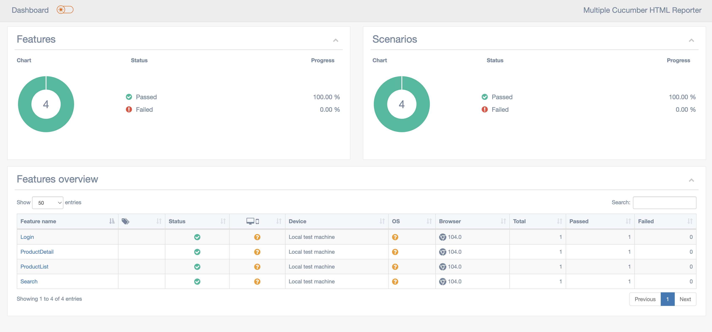
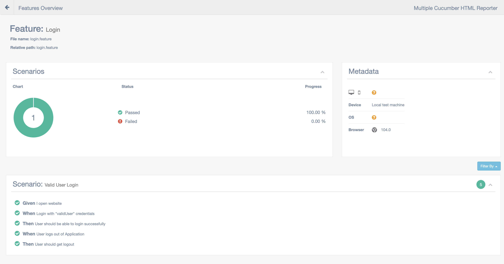

# Web Automation

This project demonstrates end-to-end web automation using [Cypress](https://www.cypress.io), an open-source testing framework based on JavaScript, and the [Cucumber BDD](https://cucumber.io/) framework, which uses English syntax to document test cases. Test reports are generated using [multiple-cucumber-html-reporter](https://www.npmjs.com/package/multiple-cucumber-html-reporter) reporting module.

## Pre-Requisites

Ensure the following tools and dependencies are installed before setting up the project:

- [Install Node.js](https://nodejs.org/en/download/)  (v14.x or higher)
- Install npm 

## Setup Build Environment

1. Clone the Repository
    > git clone https://github.com/RidmiR/web-testautomation.git

2. cd <PROJECT_HOME>

3. Install all the dependencies specified in the package.json file via npm by executing below command by being in the folder location specified in step 2
    > npm install

4. Install Cypress via npm

    > cd <PROJECT_HOME>

    > npm install cypress --save-dev
    
   This will install Cypress locally as a dev dependency for your project.

   For specific cypress version,

    > npm install --save-dev cypress@13.4.0

## Project Structure

```
web-testautomation/
│
├── cypress/
│   ├── e2e/
│   │   ├── features/
│   │   │   └── login.feature
│   │   └── step_definitions/
│   │   |    └── loginSteps.js
|   |   └── pageObjects
|   |   |    └── Login.js
|   |   |
│   ├── support/
│   │   ├── commands.js
│   │   └── e2e.js
|   ├── fixtures
|   |    └── details.json
│   |
├── reports/
│   └── multiple-cucumber-html-report/     # Generated reports will be here
│
├── .gitlab-ci.yml                # CI pipeline configuration
├── cypress.config.js             # Dependencies
├── package.json                  
└── README.md                     # Project documentation

```

## How to Run Cypress Tests

To execute Cypress tests with the Cucumber feature files:

1. Run Cypress Tests in Headless Mode Execute all tests in the terminal:
    > npx cypress run

2. Run Specific Feature File you can run a specific feature file by providing its name:
    > npx cypress run --headed --browser chrome --spec "cypress/e2e/features/*.feature"

3. Open Cypress Test Runner Launch the Cypress Test Runner UI for manual selection:
    > npx cypress open

## Generate Test Reports

The project uses multiple-cucumber-html-reporter to generate clean, detailed test reports.

1. Generate HTML Report Run the following script to generate the HTML report after test execution. 
_Please note that check the cucumber.json folder is avaible in cypress/reports path after test execution._

    > node cucumber-html-report.js

2. View the Report Open the generated HTML report in a browser.

    > open cypress/reports/cucumber-html-report/index.html

## Report Example

After running tests, you will see a detailed test report with the following features:

- Test summary
- Passed/Failed test scenarios
- Step-by-step details
- Screenshots for failed tests (if configured)

**Full Report**
<p align="center">
   
</p>

**Feature wise view**
<p align="center">
   
</p>
